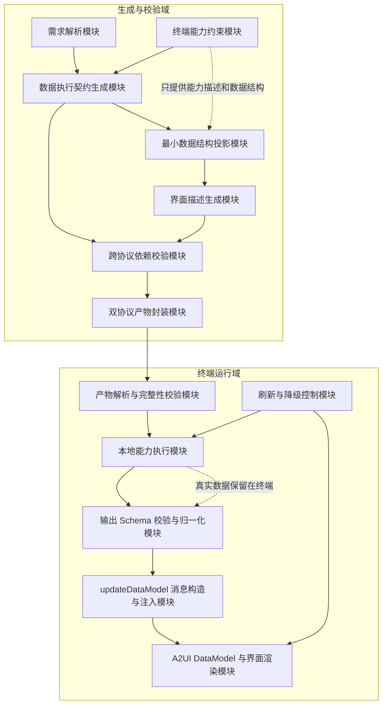
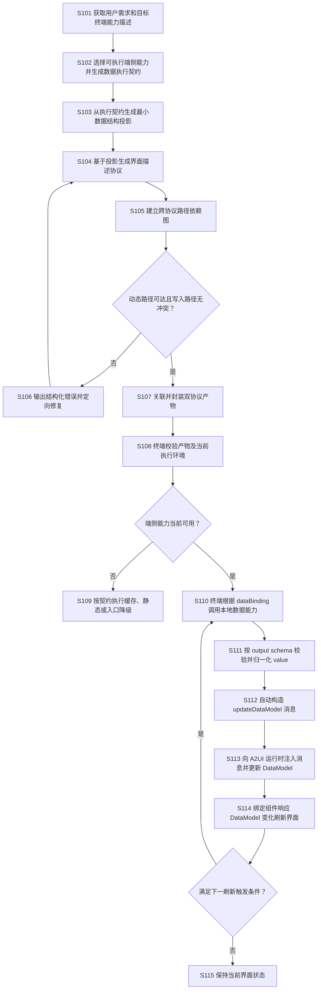

# 生成式用户界面数据执行契约驱动 DataModel 刷新专利内部评审材料

**建议发明名称**：一种基于端侧数据执行契约驱动数据模型更新消息构造的生成式用户界面生成及刷新方法、系统、设备和存储介质

**材料用途**：公司内部专利立项与技术评审

**专利类型建议**：发明专利

**保密级别**：公司内部

**核心判断**：本 idea 不是对 A2UI 内部“组件结构与 DataModel 分离”的重复设计。A2UI 中的 DataModel 是界面运行时状态空间，`updateDataModel` 是对该状态空间执行写入的协议消息；CardSpec 则是位于其上游的、可持久化执行的数据生产契约，负责声明端侧调用哪个数据能力、调用参数、能力输出结构以及结果写入哪个 DataModel 路径。端侧刷新时依据 CardSpec 执行能力，对结果进行结构校验，并自动构造 A2UI 原生 `updateDataModel` 消息。因此独立权利要求应保护“数据执行契约驱动协议原生状态更新消息构造”的运行链路，而不是泛化为普通的 UI/DataModel 分离。具体的主 Agent、微服务、HarmonyOS、A2UI 和 CardSpec 名称仅作为优选实施例。

---

## 一、本 idea 产生的背景与现有技术

### 1.1 产生背景

生成式用户界面能够根据用户自然语言和上下文动态生成卡片、表单、仪表盘等界面。现有生成式用户界面的关注重点通常是“如何生成一个可渲染的界面”，但桌面卡片等长期存在的界面还需要持续获取天气、日历、健康、设备状态等运行数据，并在数据变化后刷新显示。

如果生成模型直接生成包含数据访问逻辑的代码，会产生任意代码执行、权限越界、接口幻觉和跨平台兼容问题；如果由云端持续取得真实数据并推送界面更新，则可能增加网络依赖、刷新时延和用户数据上云风险；如果仅生成静态界面描述，则生成后的卡片无法独立、持续地运行。

由此产生的核心技术矛盾是：

1. 生成模型需要知道界面可以使用哪些数据及数据结构，但不应接触用户运行时真实数据；
2. 界面描述需要保持平台无关和安全可渲染，但真实数据获取必须由具有权限和系统能力的终端执行；
3. 界面所引用的数据路径必须与终端实际能够产生的数据路径一致，否则容易出现空白、错位、越权引用或刷新失败；
4. 卡片生成完成后，应在不重新调用生成模型、不重新生成界面结构的情况下完成多次数据刷新；
5. DataModel 更新消息只描述“向什么路径写入什么值”，本身不解决“值由哪个端侧能力产生、调用参数是什么、输出是否符合预期结构”的问题；
6. 同一生成结果需要适配不同终端版本、已安装应用、权限状态和能力集合，并在条件变化后安全降级。

### 1.2 现有技术概况

检索说明：在国家知识产权局专利公布公告系统、Google Patents 及相关平台官方开发文档中，以“声明式用户界面”“动态卡片刷新”“端侧数据处理”“界面协议”“数据协议”“生成式用户界面”“declarative user interface”“widget data binding”等为主要检索词进行了初步检索。

#### （1）声明式生成式 UI 协议

A2UI 等方案允许 Agent 使用声明式数据描述界面组件，并通过 `updateDataModel` 消息更新界面运行时 DataModel。该消息通常包含目标 Surface、写入路径和写入值；绑定到相应路径的组件据此重新渲染。其公开规范还描述了组件更新、数据模型更新和生成后结构校验机制。

局限性在于：`updateDataModel` 解决的是“如何把给定 value 写入 DataModel 并通知界面消费”，不必然描述该 value 的生产来源。公开规范的重点也不在于以独立、可持久化执行的数据生产契约声明“终端调用何种本地能力、使用什么参数、能力输出应符合什么 schema、将输出转成哪一条 `updateDataModel` 消息以及何时重复执行”。本 idea 增加的不是另一个 DataModel，而是一个能够在端侧持续产生协议原生 DataModel 更新消息的上游执行契约。

来源：[A2UI v0.9 规范](https://a2ui.org/specification/v0.9-a2ui/)

#### （2）用户界面模板与实时数据绑定配置分离

CN110795071A 公开了一种支持实时数据动态绑定的用户界面设计和代码分离方法，以界面模板描述界面，通过数据绑定文件配置实时数据库数据点，并依据数据变化刷新相应界面元素。

该方案与本 idea 距离较近，但主要面向预先设计的工业实时界面模板和数据库数据点绑定，不涉及基于自然语言或生成模型产生界面、不涉及生成前最小数据结构投影、不涉及终端注册能力的可执行契约，也没有针对生成模型可能产生的未授权路径建立跨协议依赖图校验和真实数据不上生成端的隔离机制。

来源：[CN110795071A](https://patents.google.com/patent/CN110795071A/en)

#### （3）声明式界面与 ViewModel 跨进程同步

US20240248731A1 公开了利用声明式定义、ViewModel 代理、数据绑定和同步机制在不同进程间扩展用户界面功能。其重点是跨进程共享界面状态，并通过代理 ViewModel 保持同步。

该方案没有将数据来源、能力调用参数、输出结构和结果写入位置组织为独立的端侧数据执行契约，也没有解决生成模型只基于数据结构生成界面、运行时真实数据保留在终端以及双协议路径一致性证明的问题。

来源：[US20240248731A1](https://patents.google.com/patent/US20240248731A1/en)

#### （4）单一声明式模型同时驱动界面和后端能力

US20180239497A1 公开了由声明式模型描述操作输入和界面模板，并使界面与后端操作保持一一对应。该方案将界面信息和后端操作信息组织在声明式定义中，用于动态生成操作面板。

该方案更接近“由单一模型共同驱动界面和后端”，而本 idea 刻意将可生成、可替换的界面描述与不可由模型自由修改的端侧执行契约分离，并在二者之间建立受控的数据路径映射，以降低生成模型改变运行能力或访问边界的风险。

来源：[US20180239497A1](https://patents.google.com/patent/US20180239497A1/en)

#### （5）传统 Widget 刷新机制

Android App Widgets 支持完整更新、部分更新和集合数据刷新；Apple WidgetKit 通过 TimelineProvider 和刷新策略更新 Widget 内容。这些技术证明终端侧 Widget 刷新本身属于已知能力。

其局限性在于：传统 Widget 的数据提供者、视图代码和刷新逻辑通常由开发者预先编写，不解决根据用户自然语言动态生成任意卡片后，如何自动生成与界面匹配的数据执行契约、如何验证两个协议之间的动态路径，以及如何使真实数据在不交给生成模型的情况下驱动生成界面长期运行。

来源：[Android App Widgets 更新机制](https://developer.android.com/develop/ui/views/appwidgets/advanced)、[Apple WidgetKit Timeline](https://developer.apple.com/documentation/widgetkit/timeline)

#### （6）外部 Widget 与数据连接器

US9733916B2 公开了将外部 Widget 与数据源连接，通过连接器配置查询参数、渲染参数和更新行为，并将外部数据导入引擎或数据库后进行可视化。

该方案没有解决生成模型产生的界面 DSL 与端侧本地能力契约之间的路径可达性校验，也不以运行数据不离开终端为默认数据边界。

来源：[US9733916B2](https://patents.google.com/patent/US9733916B2/)

### 1.3 现有技术存在的主要问题

1. **界面可生成但运行能力不可持续**：生成式 UI 通常解决首次渲染或直接接收一次 DataModel 更新，缺少可持久化、可复用的数据生产契约。
2. **状态写入与真实数据来源之间缺少执行桥梁**：传统数据绑定或 `updateDataModel` 消息能够说明“界面消费哪个路径”或“向哪个路径写什么值”，但未必能说明终端应调用哪个能力产生该值，也未必验证该值符合能力输出结构。
3. **真实数据存在上云风险**：为了让模型理解界面，容易将用户真实天气、日程、健康或设备状态提交至生成端。
4. **模型生成路径可能与运行输出不一致**：模型可能引用未声明字段、错误层级或已删除的数据路径，导致运行时空白或异常。
5. **生成和刷新重复消耗资源**：如果每次刷新都依赖云端重新生成或拼装界面，会增加网络传输、模型调用和终端重建开销。
6. **终端环境变化后缺少一致性处理**：应用卸载、版本变化、权限变化或系统能力变化可能使历史卡片的数据能力失效。

### 1.4 本 idea 与现有技术的本质区别

本 idea 不是简单的数据绑定，也不是再次将 A2UI 的组件结构与 DataModel 分离，更不是简单地把界面和数据写入两个文件，而是建立以下组合闭环：

> 先形成受终端能力约束的端侧数据执行契约，再由该契约投影出不含真实数据的最小 DataModel 结构，生成模型只能基于该结构生成界面描述；随后系统对界面动态路径和执行契约输出路径进行跨协议可达性校验；终端在刷新时依据契约调用本地数据能力，验证返回 value 与能力 output schema 一致，将能力结果和目标路径编译为一条协议原生 `updateDataModel` 消息并注入 A2UI 运行时，由 DataModel 变化驱动界面响应式刷新。CardSpec 描述数据生产，A2UI DataModel 描述运行状态，二者是上游生产契约与下游状态更新协议的协同关系，而非同一种分离机制。

初步检索未发现单一现有技术完整披露上述组合，但最终新颖性与创造性仍需结合申请日前的全球专利及非专利文献进行正式检索。

---

## 二、本 idea 的技术方案

### 2.1 总体思路

系统使用两类职责不同但可验证衔接的协议对象：

1. **界面及状态更新协议**：描述组件、布局、样式、数据绑定路径、交互事件、DataModel 和数据模型更新消息，用于终端安全渲染界面并消费状态变化。该协议不负责决定真实数据由哪个端侧能力产生。
2. **端侧数据执行契约**：描述终端可执行的数据能力、调用参数、能力 output schema、结果写入 DataModel 的目标路径、版本依赖和可选刷新策略。该契约不直接携带本轮真实 value，也不负责具体界面布局。

两类协议通过 DataModel 路径形成生产—消费关系。界面描述中的每个动态引用都必须能够从端侧数据执行契约的“目标写入路径 + output schema”推导得到。系统在交付前验证该关系；终端在刷新时执行数据契约，将能力返回结果校验为与 output schema 一致的 value，再自动构造包含目标 Surface、目标路径和该 value 的 `updateDataModel` 消息。A2UI 运行时消费该消息并更新 DataModel，不需要重新生成界面。

### 2.2 系统框图



### 2.3 核心协议对象

#### 2.3.1 界面及状态更新协议

界面及状态更新协议至少可以包括：

- 界面或 Surface 标识；
- 组件及组件之间的引用关系；
- 布局、样式和目标尺寸；
- 组件属性所引用的 DataModel 路径；
- 允许的交互事件及事件参数路径；
- 初始化 DataModel 以及用于后续更新 DataModel 的协议消息类型；
- 组件目录版本和界面协议版本。

生成模型可以生成或修改界面结构及初始化 DataModel，但只能使用预先允许的组件、属性、事件及数据路径。运行期新增的 `updateDataModel` 消息可由终端依据数据执行契约确定性构造，不需要由生成模型逐次生成。

#### 2.3.2 端侧数据执行契约

端侧数据执行契约至少可以包括：

- 端侧能力标识或能力类别；
- 能力调用参数；
- 能力 output schema 或其版本化标识；
- 结果写入 DataModel 的命名空间；
- 能力和系统版本依赖；
- 可选的数据有效期、周期刷新、事件刷新或可见性刷新策略；
- 可选的数据驻留策略，例如仅端侧使用、脱敏后允许上传或禁止回传；
- 可选的失败缓存、静态降级或入口降级策略。

其中，每个 `dataBinding` 至少建立“端侧能力 + 调用参数 + 目标 DataModel 路径”的执行关系，能力注册信息提供相应 output schema。刷新策略、数据驻留策略和双协议摘要绑定可以作为增强 CardSpec 的优选实施方式；若当前实现尚未支持，不影响核心方案以“端侧能力调用、output schema 和写入路径”驱动 `updateDataModel` 消息构造的基本闭环。

#### 2.3.3 两类协议与 DataModel 的关系

三者不是平行或重复关系：

1. CardSpec 类数据执行契约是**数据生产描述**，声明在刷新触发时应调用哪个端侧能力以及把结果送往哪个路径；
2. A2UI `updateDataModel` 是**状态变更指令**，承载本次实际写入的 Surface、path 和 value；
3. A2UI DataModel 是**运行时状态容器**，保存更新后的 value，并被界面组件的数据绑定消费；
4. 端侧运行时是协议桥接执行者，把数据执行契约编译为一次或多次具体的 `updateDataModel` 消息。

因此，本 idea 所称“双协议”是“数据生产契约协议”与“界面及状态更新协议”的协同：前者回答 value 从何而来以及写到哪里，后者回答如何将本次 value 写入状态空间并驱动 UI 更新。

一种简化实施例为：

```text
数据执行契约中的 dataBinding：
  能力 = CAPABILITY_X
  参数 = ARGUMENTS_X
  输出结构 = OUTPUT_SCHEMA_X
  目标路径 = /data/x

端侧刷新时：
  RESULT_X = invoke(CAPABILITY_X, ARGUMENTS_X)
  validate(RESULT_X, OUTPUT_SCHEMA_X)

自动构造并追加到 A2UI 运行时消息流：
  updateDataModel.surfaceId = TARGET_SURFACE
  updateDataModel.path = /data/x
  updateDataModel.value = RESULT_X
```

这里的关键不是 CardSpec 与 DataModel 各自存在，而是 CardSpec 中的 `dataBinding` 能够被终端解释执行，并确定性地产生后续 A2UI `updateDataModel` 消息；该消息的 value 结构受能力 output schema 约束，path 受 CardSpec 约束，最终由 A2UI DataModel 和组件绑定消费。

#### 2.3.4 最小数据结构投影

生成控制端不向界面生成模型提供用户的真实运行数据，而是根据端侧数据执行契约生成最小数据结构投影。投影只保留当前界面可能使用的字段路径、字段类型、字段语义和脱敏或合成示例值。

例如，终端数据能力可以输出完整天气对象，但若用户只要求显示温度和天气现象，则投影只向界面生成模型提供“温度展示字段”和“天气现象字段”的结构描述。真实温度和真实位置在终端运行时取得。

### 2.4 生成、校验与运行流程



### 2.5 流程文字说明

#### S101：获取需求和目标终端能力描述

系统获取用户对卡片或界面的自然语言需求，并获取目标终端所支持的组件目录、数据能力、版本信息和可选事件能力。该步骤只获取能力描述和数据结构，不要求获取用户真实运行数据。

#### S102：生成端侧数据执行契约

系统根据用户需求选择一个或多个已注册端侧能力，为每个能力确定合法参数、输出结构以及不冲突的数据写入命名空间。生成模型不能自行创造未注册能力，也不能修改能力的原始输入输出约束。

#### S103：生成最小数据结构投影

系统从执行契约的输出结构中选择当前界面需要的最少字段，将字段类型、语义和脱敏示例组织为模型可理解的数据结构。投影可以进一步附带允许引用的路径集合和禁止引用的敏感字段集合。

#### S104：生成界面描述协议

界面生成模型依据用户需求、目标尺寸、组件目录和最小数据结构投影生成声明式界面。模型只负责界面表达，不负责决定终端调用何种能力，也不负责修改最终数据执行契约。

#### S105：建立跨协议路径依赖图并校验

系统从界面描述中提取组件动态路径、样式动态路径和事件参数路径，从数据执行契约中提取各能力的写入命名空间及 output schema，并建立“端侧能力—输出字段—目标 DataModel 路径—`updateDataModel` 消息—界面消费者”依赖图。

至少执行以下校验：

1. 每个界面动态路径均能由某个端侧能力目标写入路径与其 output schema 推导，或属于允许的静态初始化路径；
2. 不同能力的写入命名空间不相同、不互为父子且不相互覆盖；
3. 界面未引用投影范围以外的敏感字段或未授权字段；
4. 事件参数路径能够由已声明的输出字段推导；
5. 界面尺寸、协议版本、组件目录版本和执行契约版本相互兼容；
6. 数据能力删除或降级后，不存在残留组件绑定或悬空事件参数。

一种优选实现可以在产物中保存路径证明清单或其摘要，用于终端快速复核两个协议是否配对且未被替换。

#### S106：定向修复

校验失败时，系统将错误归纳为路径不存在、写入冲突、版本不兼容、未授权字段等结构化错误，仅要求界面生成模块修改相关界面部分。端侧数据执行契约仍由确定性模块生成和裁决，不交给生成模型自由修改。修复次数可以受预设次数或时延预算限制。

#### S107：封装双协议产物

通过校验后，将界面描述协议、端侧数据执行契约、版本信息及可选的路径证明摘要封装为同一产物。优选地，可以分别计算两个协议对象的摘要，再计算组合摘要或签名，防止运行时将来自不同生成轮次的两个协议错误配对。

#### S108—S114：终端执行、更新消息构造与响应式刷新

终端收到产物后再次检查协议版本、摘要和当前能力可用性。对于可执行的能力，终端读取 CardSpec 类契约中的 `dataBinding`，按照其中的能力标识和参数在本地获取真实数据；将返回结果与对应能力的 output schema 进行校验和归一化；以 `dataBinding` 声明的目标路径作为 `path`，以能力返回结果作为 `value`，结合目标 Surface 标识自动构造一条 A2UI 原生 `updateDataModel` 消息；随后将该消息注入 A2UI 解释器或渲染运行时。A2UI 运行时更新 DataModel，绑定到相关路径的组件响应数据变化并刷新。整个刷新过程无需重新调用界面生成模型，也无需重新生成组件树。

默认情况下，真实数据只在终端能力执行模块、`updateDataModel` 消息、DataModel 和渲染模块之间流动；生成端只持有字段结构、能力描述和脱敏示例。若业务确需回传，应由数据驻留策略明确允许，并执行最小化、脱敏和授权检查。

#### S109：环境变化后的降级

如果终端能力在运行时不可用，系统不伪造数据。可以按照契约选择使用未过期缓存、隐藏相应动态区域、替换为静态说明、保留应用入口，或者提示重新生成。降级后仍需保证界面中不存在无法解析的动态引用。

### 2.6 实施方式举例

以天气日程卡片为例，生成端生成的界面描述包含天气温度、天气现象、日程标题和开始时间的展示路径；CardSpec 类端侧数据执行契约的 `dataBindings` 包含天气查询和日历查询两类能力、各自参数及独立写入路径，能力注册信息分别提供对应 output schema。

生成阶段只向界面模型提供上述四类展示字段的结构和脱敏示例，不提供用户当前位置、真实天气或真实日程。终端添加卡片后，在每次刷新触发时分别读取两条 `dataBinding`，本地调用天气与日历能力，确认返回 value 与对应 output schema 一致，再为两个互不覆盖的目标路径分别自动生成 `updateDataModel` 消息。A2UI 运行时执行消息后更新两个 DataModel 子树，渲染器据此刷新卡片。若日历权限被关闭，终端隐藏或降级日程区域，但继续刷新天气区域。

上述示例不构成对具体操作系统、卡片尺寸、数据类型或协议编码格式的限制。

---

## 三、本 idea 的技术保护点

### P1：数据生产契约与界面状态更新协议的协同分工

将可由生成模型产生的界面及状态更新协议，与描述端侧真实数据生产行为的数据执行契约分工设置。数据执行契约不替代 A2UI DataModel，而是声明生成后续 DataModel 更新 value 所需的端侧能力、参数、output schema 和目标路径；界面协议负责消费终端据此构造的状态更新消息。

这是区别于“A2UI 内部组件与 DataModel 分离”“一个声明式文件同时驱动界面和后端”以及“界面模板中直接写数据源”的基础结构。

### P2：执行契约先行的数据结构投影和界面生成顺序

先根据目标终端实际能力形成受控的数据执行契约，再从契约输出结构中生成最小数据结构投影，最后让生成模型基于投影生成界面；生成模型不能反向创造端侧能力或扩大数据访问范围。

需要重点保护“契约先行—结构投影—界面生成”的因果顺序，而不是仅保护两个文件并存。

### P3：真实数据与生成模型隔离的端侧数据闭环

生成端仅获得数据结构、字段语义及脱敏或合成示例，真实运行数据由终端依据执行契约本地获取、本地归一化并写入 DataModel，界面在终端完成刷新。默认不将真实运行数据发送至生成模型或生成控制端。

### P4：基于更新消息可构造性的跨协议路径校验

从两个协议抽取数据生产者、output schema、目标写入路径、可构造的 `updateDataModel` 消息和界面消费者，建立跨协议依赖图，验证动态路径可达性、更新消息可构造性、写入冲突、敏感字段越界、事件参数来源和删除后悬空引用。

区别于普通 JSON Schema 校验，本保护点验证的是两个异构协议共同构成的运行闭环是否成立。

### P5：能力输出自动编译为协议原生 DataModel 更新消息

卡片首次生成并安装后，终端在刷新条件满足时读取持久化数据执行契约，调用本地能力，将通过 output schema 校验的返回结果作为 value，将契约声明的 DataModel 写入位置作为 path，自动构造并注入协议原生 `updateDataModel` 消息。该编译过程可以重复执行，只更新 DataModel，不重新生成或下发完整界面描述。

### P6：双协议配对完整性和版本兼容

对界面描述协议、数据执行契约及二者组合关系分别计算摘要或签名，在终端解析时验证其属于同一生成轮次，并根据终端版本选择兼容协议组合。该点适合作为从属保护点。

### P7：环境变化下的同步裁剪与可用性降级

当端侧能力、权限、应用安装状态或协议版本变化时，重新裁决数据执行契约，并同步清理界面中的对应绑定、事件和展示区域；不允许仅删除执行能力而保留悬空界面路径。该点可与多轮编辑形成后续独立专利。

### 3.1 建议的权利要求层级

建议独立权利要求至少包含 P1—P5，构成完整技术闭环：

1. 获取用户界面需求及目标终端能力描述；
2. 生成包含本地能力调用、输出结构和写入命名空间的数据执行契约；
3. 从数据执行契约生成不含真实运行数据的数据结构投影；
4. 基于数据结构投影生成界面描述协议；
5. 校验界面动态路径能够由数据执行契约输出路径推导；
6. 将两个协议关联下发至终端；
7. 终端本地执行契约，将能力返回结果按 output schema 校验后编译为包含目标 path 和 value 的 DataModel 更新消息；
8. 向界面协议运行时注入所述更新消息，并在不重新生成界面的情况下刷新绑定组件。

P6、P7，以及刷新策略、数据驻留策略、路径证明清单、有限次数定向修复、字段最小投影等可作为从属权利要求逐层限定。

### 3.2 不建议单独作为核心保护点的内容

- 主 Agent 调用微服务的具体架构；
- 三个工具接口或某个接口名称；
- JSON、JSONL 或某一字段名称；
- A2UI、HarmonyOS、CardSpec 或某个组件目录名称；
- 固定的 2x2、2x4 卡片尺寸；
- 仅仅“使用大模型生成 UI”；
- 仅仅“UI 与数据分离”或“端侧刷新”。

这些内容可以作为实施例，但单独保护容易被现有技术覆盖或被竞争对手通过替换架构和编码格式规避。

---

## 四、本 idea 的技术效果

| 对应保护点 | 技术效果 | 建议验证指标 |
| --- | --- | --- |
| P1 数据生产契约与状态更新协议协同 | 将“数据如何产生”与“状态如何写入并被界面消费”分层；在 output schema 和目标路径稳定时，可替换端侧数据适配器而不修改界面及其绑定 | 相同界面支持的数据适配器数量；替换数据实现时界面修改行数或协议变更量 |
| P2 契约先行与最小投影 | 限制生成模型只能使用终端可提供的数据字段，减少无关字段进入模型上下文，降低无效路径和能力幻觉 | 模型输入字段数、输入字符数、未声明字段生成率、首次校验通过率 |
| P3 真实数据端侧闭环 | 真实天气、日历、健康或设备状态默认不离开终端，降低隐私泄露面和网络依赖 | 运行时真实数据上传字节数；离线或弱网状态下的刷新成功率；敏感数据出端次数 |
| P4 更新消息可构造性校验 | 在交付前证明每条动态数据均存在“能力输出—目标路径—更新消息—界面绑定”的完整链路，提前发现路径不存在、写入冲突、越权字段和删除后悬空引用 | 更新消息不可构造错误拦截率、路径错误拦截率、写入冲突拦截率、运行时绑定异常率 |
| P5 自动构造协议原生更新消息 | 将任意已注册端侧能力的标准化输出统一转换为渲染协议原生更新消息；无需重复调用生成模型或重新传输完整界面结构 | 单次消息构造耗时、单次刷新时延、刷新网络流量、模型调用次数、界面重建次数、功耗 |
| P6 配对完整性与版本兼容 | 避免来自不同版本或不同轮次的界面协议和数据契约被错误组合，降低协议错配和篡改风险 | 错配产物识别率、摘要校验耗时、版本不兼容拦截率 |
| P7 同步裁剪与降级 | 能力失效时不产生虚假数据，并防止界面继续引用已删除路径，使剩余区域保持可用 | 单能力失效后的卡片可用率、悬空路径数量、降级成功率 |

### 4.1 预期综合效果

与“云端持续推送真实数据并重新生成界面”的方案相比，本 idea 预期能够实现：

1. 用户真实运行数据默认零上传至界面生成模型；
2. 一次生成、多次本地刷新，降低生成模型调用频率；
3. 将端侧能力输出编译为轻量的协议原生 DataModel 更新消息，减少完整界面结构重复传输；
4. 将模型生成错误从运行期提前到交付前发现；
5. 通过统一抽象适配不同操作系统和端侧能力框架；
6. 在部分能力失效时保留仍有价值的界面区域。

正式申请前建议补充一组原型对比数据，包括：完整界面重生成与 DataModel 本地更新的时延、流量、功耗差异；引入跨协议校验前后的运行错误率；完整能力结构与最小字段投影的模型输入量和首次生成通过率。

---

## 五、本 idea 的取证方法

取证应在合法授权、遵守软件许可及数据合规要求的前提下进行。可以综合使用产品黑盒测试、网络流量分析、公开文档、安装包或产物结构分析、运行时日志和司法鉴定等方式，不依赖获取竞争对手源代码。

### 5.1 保护点与取证方式对应表

| 保护点 | 可观察事实 | 主要取证方法 | 预期证据 | 取证难度 |
| --- | --- | --- | --- | --- |
| P1 数据生产契约与状态更新协议协同 | 同一生成结果中同时存在界面及 DataModel 描述和独立的数据能力调用描述；刷新时后者产生前者能够直接消费的更新消息 | 获取官方 SDK、开发文档、公开协议、导出的卡片文件或经授权的本地缓存；比较两个协议对象、运行期更新消息及路径关系 | 协议文档、产物样本、运行期消息样本、字段结构截图、解析报告 | 中 |
| P2 契约先行与最小投影 | 生成界面只能引用端侧契约允许字段；改变终端能力集合会改变可生成字段或最终界面 | 在两个能力集合不同的测试终端上输入相同需求；记录生成请求、返回产物及差异 | 对比测试视频、终端环境记录、两份产物及路径差异、接口日志 | 中高 |
| P3 真实数据端侧闭环 | 卡片可在真实数据变化后刷新，但网络中未出现对应真实数据上传至生成服务 | 在可控网络代理或企业测试网关下抓包；切断生成服务网络后改变本地天气缓存、日历、设备状态或测试数据源 | 抓包文件、域名与请求清单、离线刷新视频、本地日志、数据变化前后截图 | 中 |
| P4 更新消息可构造性校验 | 路径不匹配、output schema 不匹配、写入冲突或越权字段导致更新消息无法构造时，会在安装或运行前被拒绝或触发修复 | 在授权测试环境中构造路径缺失、返回 value 结构错误、父子写入冲突、未声明字段等畸形产物；观察服务端或终端行为 | 畸形样本、错误响应、校验日志、拒绝安装视频、修复前后产物对比 | 中高 |
| P5 自动构造协议原生更新消息 | 首次安装后，每次刷新均表现为读取 dataBinding、调用本地能力、校验 value、构造新的 `updateDataModel` 消息并更新 DataModel，没有重新获取完整界面协议 | 连续触发刷新，记录本地能力调用、协议消息流、界面结构摘要和运行日志 | 多轮 `updateDataModel` 消息、path/value 与契约对应关系、界面协议摘要不变记录、性能数据 | 中 |
| P6 配对完整性与版本兼容 | 替换其中一个协议对象或使用不同版本组合时，产物被拒绝或迁移 | 在授权测试环境中交换两份产物的界面部分和数据契约部分，或修改版本号和摘要 | 错配样本、完整性错误、版本迁移日志、拒绝加载结果 | 高 |
| P7 同步裁剪与降级 | 撤销权限、卸载数据提供应用或禁用端侧能力后，相应界面区域与数据绑定同时消失或降级 | 生成卡片后改变权限、应用安装状态或测试能力开关，再触发刷新或编辑 | 操作录像、前后产物、界面截图、能力调用失败与降级日志 | 中 |

### 5.2 重点取证方案

#### 方案 A：双协议产物取证

1. 使用目标产品生成一张包含至少一种动态数据的卡片；
2. 通过产品公开导出能力、调试接口、终端备份、经授权本地目录或网络响应取得卡片产物；
3. 对产物进行只读解析，识别界面组件树、初始化 DataModel、动态路径、CardSpec 类 `dataBindings`、能力 output schema、目标写入路径和协议版本；
4. 触发至少两次刷新，记录端侧自动产生的 `updateDataModel` 消息，并建立“dataBinding—能力输出—消息 path/value—DataModel—界面引用”的对应表；
5. 对原始文件计算哈希并保全获取时间、设备环境和操作录像。

如果能够证明数据执行契约不直接承载本次真实 value，而是在刷新时稳定地产生界面协议原生的 `updateDataModel` 消息，且消息 path/value 与能力 output schema、目标写入路径和界面绑定一一对应，即可对 P1、P4、P5 和 P6 形成较强证据。

#### 方案 B：真实数据不上生成端取证

1. 在测试终端生成并添加包含日历或设备状态的动态卡片；
2. 记录生成阶段网络请求，并区分字段结构、脱敏样例和真实用户数据；
3. 生成完成后关闭生成服务网络连接，保留本地数据能力可用；
4. 修改测试日历事件或设备状态并触发卡片刷新；
5. 记录卡片显示变化、终端本地调用日志、自动构造的 `updateDataModel` 消息和全部网络流量；
6. 验证真实数据未发送至生成服务，但以消息 value 的形式进入终端 DataModel 并完成刷新。

该方案可以重点证明 P3 和 P5。若网络完全离线仍可刷新，证明力更强；若数据能力本身需要访问网络，则应区分“数据服务网络请求”与“界面生成服务请求”，避免错误结论。

#### 方案 C：跨协议校验取证

1. 在合法授权的测试环境复制一份正常产物；
2. 分别构造动态引用不存在、能力返回 value 不符合 output schema、写入路径相互覆盖、引用敏感字段、协议版本错配等测试样本；
3. 将测试样本提交至生成服务校验接口或终端测试入口；
4. 记录系统是否在渲染前拒绝、是否给出结构化错误、是否只修复界面协议以及修复后数据执行契约是否保持受控；
5. 对正常样本和异常样本的处理结果进行对照。

该方案主要证明 P4，也可辅助证明 P2 和 P6。

#### 方案 D：能力变化与同步降级取证

1. 在能力可用时生成包含两类动态数据的卡片；
2. 撤销其中一类数据权限、卸载对应应用或关闭测试能力开关；
3. 触发刷新、重新加载或多轮编辑；
4. 观察失效能力对应的数据契约、界面绑定和展示区域是否被同步裁剪；
5. 验证另一类仍可用能力是否继续刷新。

该方案可以证明系统不是简单地显示空值，而是根据当前执行环境重建或降级双协议闭环，对 P7 具有较高证明力。

### 5.3 证据保全建议

1. 所有测试均记录设备型号、系统版本、应用版本、时间和网络环境；
2. 原始产物、抓包文件、日志和录像分别计算哈希并保留只读副本；
3. 使用统一测试脚本重复至少两次，排除偶发刷新或缓存影响；
4. 对涉及用户数据的测试使用专门测试账号和合成数据；
5. 对难以通过黑盒确认的“契约先行生成顺序”，优先结合官方技术文档、开发者演讲、SDK 接口说明、错误日志和不同终端能力条件下的差分测试；
6. 进入诉讼或无效程序前，由专业机构通过公证取证、可信时间戳或司法鉴定固定关键事实。

### 5.4 取证可行性结论

本 idea 的主要保护点具有较好的外部可观察性：双协议产物、`dataBinding` 与运行期 `updateDataModel` 消息的映射、消息 path/value 与 output schema 的关系、网络数据边界、刷新时是否重新生成界面、畸形产物的校验反应和权限变化后的同步降级均可通过黑盒或灰盒方式验证。相较于仅保护内部模型 Prompt 或微服务编排逻辑，本方案更容易形成可复现、可保全的侵权比对证据，因此具有较高的实际保护价值。

---

## 六、内部评审建议

### 6.1 建议立项结论

建议以本材料所述“数据执行契约驱动协议原生 DataModel 更新消息构造与端侧隐私刷新闭环”作为主专利立项，优先保护 P1—P5 的组合，不以具体产品架构和协议名称限制保护范围。

### 6.2 建议同步准备的技术材料

1. A2UI 界面及初始化 DataModel、CardSpec `dataBindings`、运行期新增 `updateDataModel` 消息各一份脱敏样例；
2. 从执行契约输出结构生成最小字段投影的示例；
3. 跨协议路径依赖图和至少四类错误样例；
4. 一次生成、多次端侧刷新的时序日志，明确展示每次“读取 dataBinding—调用能力—校验 output schema—构造 updateDataModel—更新界面”的链路；
5. 真实数据不上生成端的网络流量证明；
6. 能力失效后同步降级的前后产物；
7. 与传统“服务端推送 DataModel”和“开发者预编码 Widget Provider”的对照实验。

### 6.3 可拆分的后续专利

1. **多轮编辑专利**：基于不可变来源产物、数据执行契约重建和当前终端能力重新裁决的生成式 UI 编辑方法；
2. **校验专利**：基于跨协议依赖图、路径证明和错误驱动定向修复的生成式 UI 校验方法；
3. **隐私投影专利**：基于敏感字段标记、最小字段投影和合成示例值的生成式 UI 数据隔离方法。
